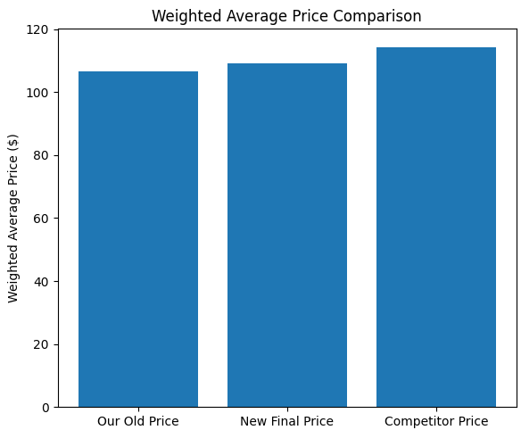
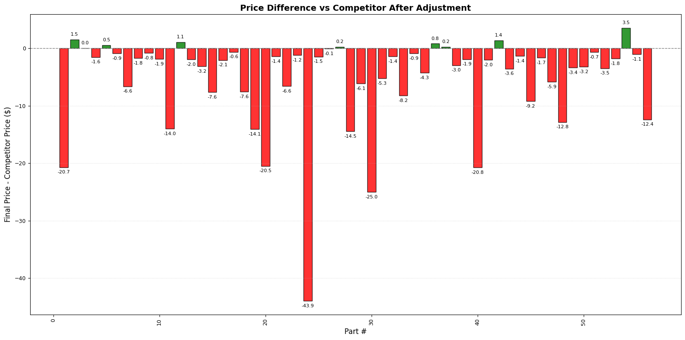
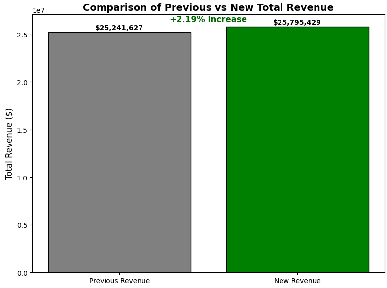

# Pricing Strategy Optimization

## Project Overview

This project presents a comprehensive analysis and solution to a complex pricing problem. The goal was to implement a strategic price adjustment for 56 products based on a set of specific business rules. The analysis was initially performed in Microsoft Excel using advanced formulas and the Goal Seek tool, and the results were then visualized using Python (Pandas & Matplotlib) to create insightful charts for business stakeholders.

## The Business Problem & Assignment

The management team provided a clear, multi-faceted assignment:

1.  **Financial Target:** Achieve an overall **weighted average price increase of 2.2%** across all products.
2.  **Competitive Strategy:** While increasing prices, strategically **minimize the variance** between our prices and those of a key competitor.
3.  **Customer Retention:** To avoid market disruption, no single product's price could be adjusted by **more than +/- 15%** from its original price.

## Methodology: Excel Analysis

The solution was developed using a logical, step-by-step process in Microsoft Excel, which can be replicated for future pricing reviews.

1.  **Data Preparation:** Initial helper columns were created to calculate `Original Revenue`, and the `Min Price` (-15%) and `Max Price` (+15%) boundaries for each product.

2.  **The "Closeness Factor" Concept:** Instead of adjusting 56 prices individually, a single optimization variable called the **"Closeness Factor"** was created. This factor (a percentage) determines how much of the gap between our price and the competitor's price should be closed.

3.  **Optimization with Goal Seek:** Excel's **Goal Seek** tool was used to find the perfect "Closeness Factor." The tool was configured to change this one factor until the total `Achieved New Revenue` precisely matched the `Target Revenue` (Original Revenue + 2.2%).

4.  **Enforcing Constraints:** The prices generated by Goal Seek represented an "ideal" world. A final formula `MAX(Min Price, MIN(Max Price, Ideal Price))` was applied to every product. This crucial step "clipped" any price that exceeded the +/- 15% boundaries, ensuring full compliance with the business rules.

The final result was a set of new prices that achieved a **2.19% weighted average increase**, the closest possible outcome while strictly adhering to all constraints.

## Key Findings & Visualizations

The following visualizations were created in Python to tell the story of our findings. They validate the success of the pricing model and provide clear insights for the business.


### 1. Price Comparison: New vs. Old and Competitor

This chart shows that our new prices (green) have successfully moved away from our old prices (blue) and are now more tightly aligned with our competitor's prices (orange).


### 2. Price Change Distribution: Validating the +/- 15% Rule

This histogram proves that we adhered to the critical customer retention rule. Every single price change falls within the -15% to +15% range, with a large number of products receiving a healthy increase between 5% and 15%.


### 3. Competitor Price Difference After Adjustment

This chart visualizes our improved competitive position. After the changes, most of our prices are now very close to the competitor's (the zero line), with a more balanced distribution of products priced slightly above or below, indicating a deliberate and strategic positioning.


### 4. Competitive Positioning: Strategic Realignment

**Insight:** This visualization tells the strategic story.
*   **Our Old Price:** The weighted average of our original prices was significantly lower than the competitor's.
*   **New Final Price:** Our new pricing is now positioned much closer to the competitor, closing a significant portion of the gap.
*   **Insightful Detail:** Importantly, our new average price is still slightly *below* the competitor's. This is a strong strategic position, as it allows us to capture increased revenue without positioning ourselves as the most expensive option in the market, thereby maintaining a competitive edge.
  


---

### 5. Per-Product Analysis: Getting Closer to the Competitor

**Insight:** This detailed chart breaks down the "why" behind our strategy on a per-product basis. The bars show the dollar difference between our new price and the competitor's price (the zero line).
*   **Red Bars:** These are products where our new price is still below the competitor's. The model intelligently increased these prices but often kept them competitively lower. Notice the significant increases for products that were previously priced far too low (e.g., Part #22, where the gap was -$43.9).
*   **Green Bars:** These are the few products where we are now priced slightly higher than the competitor, a strategic decision likely based on volume and margin.
*   **Overall Picture:** The chart clearly shows that we have dramatically reduced the overall price variance. Instead of having many products priced far below the competitor, most are now clustered tightly around the zero line, indicating a more consistent and data-driven pricing policy. 



---

### 6. Overall Revenue Impact: A Successful Increase

**Insight:** This chart provides the most important top-line result for the business. Our strategic price adjustments successfully lifted the total projected revenue from **$25.24 million** to **$25.80 million**. This represents a **+2.19% increase**, which is perfectly aligned with the project's primary financial goal of 2.2%. The small difference (0.01%) is a direct result of adhering to the strict +/- 15% individual price change rule, demonstrating a successful balance between revenue growth and customer retention.




## Repository Structure

```
Pricing-Strategy-Analysis/
├── README.md                 <- You are here
├── requirements.txt          <- Required Python libraries
├── data/
│   ├── original_pricing_data.csv <- The raw input data
│   └── final_pricing_output.csv  <- The final CSV with all calculations
├── notebooks/
│   └── Price_change_assessment_NAPA.ipynb <- Python notebook with analysis
└── visualizations/
    └── (Static PNG chart images generated by the notebook)
```

## How to Run This Project

1.  Clone this repository.
2.  Ensure the data files are in the `data/` directory.
3.  Install the required Python packages:
    ```bash
    pip install -r requirements.txt
    ```
4.  Open and run the Jupyter Notebook `notebooks/Price_change_assessment_NAPA.ipynb` to see the analysis and regenerate the visualizations.

## Tools and Libraries

-   **Analysis:** Microsoft Excel (Goal Seek, Advanced Formulas)
-   **Visualization & Automation:** Python
-   **Python Libraries:** Pandas, Matplotlib
